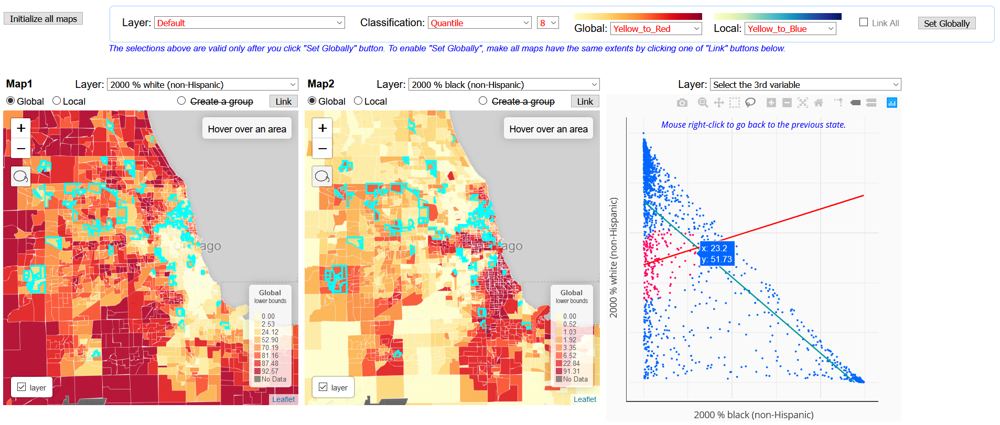
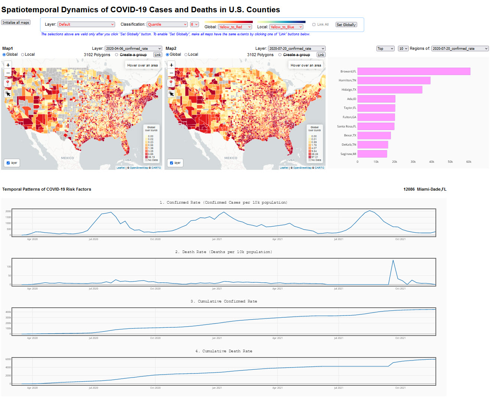

# CyberGIS-Vis

<p align="center">

</p>

<h2 align="center" style="margin-top:-10px">CyberGIS-Vis is an open-source software tool for interactive geospatial visualization and scalable visual analytics.</h2> 
<br/>


CyberGIS-Vis integrates cutting-edge cyberGIS and online visualization capabilities into a suite of software modules for visualization and visual analytical approaches to knowledge discovery based on geospatial data. Key features of the current CyberGIS-Vis implementation include: (1) comparative visualization of spatiotemporal patterns through choropleth maps; (2) dynamic cartographic mapping linked with charts to explore high-dimensional data; (3) reproducible visual analytics through integration with CyberGIS-Jupyter; and (4) multi-language support including both Python and Javascript. [Firefox is the recommended web browser for reaping the best performance of CyberGIS-Vis.](https://www.mozilla.org/en-US/firefox/new/)

<br/><br/>

## QuickStart

**Example visaulizations are available in the two folders below:**<br/>
*	Quantitative_Data_Vis <br/>
*	Categorical_Data_Vis <br/>
<br/>

**You can run CyberGIS-Vis in your Jupyter Notebook installed on your PC as well as in CybearGISX. We recommend that you use CyberGISX because all the required packages have been integrated in CyberGISX.**<br/><br/>

**To use it in CyberGISX, follow steps below:**
1. If you do not have a CyerGISX account, create a CyberGISX account with your GitHub id at https://cybergisxhub.cigi.illinois.edu
2. Begin by clicking the yellow 'Open with CyberGISX' button in this published notebook, available at this [link](https://cybergisxhub.cigi.illinois.edu/notebook/cybergis-viz-for-democratizing-access-to-scalable-geovisualization-2nd-version/).
   
**To run in the loca environment, follow steps below.**
1. Download and install Anaconda at https://www.anaconda.com/.
2. After installation is done, open "Anaconda Prompt" and enter command lines below to create an environment.
```bash
        conda create -n geo-env -c conda-forge geopandas
        conda activate geo-env
        conda install -c conda-forge jupyterlab
        jupyter lab
``` 
3. Open Python Script below.
```bash
        Quantitative_Data_Vis/Adaptive_Chropleth_Mapper.py
        Categorical_Data_Vis/Qualitative_Analysis_Mapper.py
```
4. Comment and uncomment out like below. These are related to create URLs in the Jupyter Server. 
```bash
	#from jupyter_server import serverapp

	#jupyter_envs = {k: v for k, v in os.environ.items() if k.startswith('JUPYTER')}
	#temp_server = jupyter_envs['JUPYTER_INSTANCE_URL']
	
	#servers = list(serverapp.list_running_servers())
	#servers1 = temp_server+servers[0]["base_url"]+ 'view'
	#servers2 = temp_server+servers[0]["base_url"]+ 'edit'
	
	local_dir1 = cwd
	local_dir2 = cwd 
	
	#local_dir1 = servers1 + cwd + '/'
	#local_dir2 = servers2 + cwd + '/' 
```   
5. Open Jupyter notebook below and run.
```bash
        Quantitative_Data_Vis/Adaptive_Chropleth_Mapper.ipynb
        Categorical_Data_Vis/Qualitative_Analysis_Mapper.ipynb
``` 
<br/><br/>

## Getting Started with Spatiotemporal Modules in CyberGIS-Vis: Tutorial Videos


https://github.com/user-attachments/assets/1a9d833d-e5d3-429a-b142-9d7fb784522b


## Visualization Modules
<font color="green">
Images below show visualizations that you can create using CyberGIS-Vis. Click the image to see the full size.</font >

###  Quntitative Data Visualization
<ul>
        <li>Adaptive Choropleth Mapper (ACM)</li>
        <ul><li><a href="https://su-gis.org/ACM">Click to see more information</a></li></ul>   
		<li>Adaptive Choropleth Mapper with Stacked Chart
	        <ul><li> The Stacked Chart visualizes the temporal change. Click to see 
			 <a href="https://su-gis.org/CyberGIS-Vis/videos/VIZ_Stacked_Chart.mp4"> demo.</a>
			</li></ul>    
       </li> 
        
		<li>Adaptive Choropelth Mapper with Correlogram
	        <ul><li> Click to see 
			 <a href="https://su-gis.org/CyberGIS-Vis/videos/VIZ_Correlogram_Tutorial.mp4"> Tutorial </a> and 
			 <a href="https://su-gis.org/CyberGIS-Vis/videos/VIZ_Correlogram_demo.mp4"> Demo </a> 
			</li></ul> 		
		</li>
        
        <li>Adaptive Choropleth Mapper with Scatter Plot
	        <ul><li> Click to see 
			 <a href="https://su-gis.org/CyberGIS-Vis/videos/VIZ_Scatter_Tutorial.mp4"> Tutorial </a> and 
			 <a href="https://su-gis.org/CyberGIS-Vis/videos/VIZ_Scatter_Demo.mp4"> Demo </a> 
			</li></ul> 	
		</li>
		
        <li>Adaptive Choropleth Mapper with Parallel Coordinate Plot (PCP) 
	        <ul><li> Click to see 
			 <a href="https://su-gis.org/CyberGIS-Vis/videos/VIZ_PCP_Tutorial.mp4"> Tutorial </a> and 
			 <a href="https://su-gis.org/CyberGIS-Vis/videos/VIZ_PCP_demo.mp4"> Demo </a> 
			</li></ul> 	
		</li>
        
        <li>Adaptive Choropleth Mapper with Multiple Linked Chart (MLC) 
	        <ul><li> Click to see 
			 <a href="https://su-gis.org/CyberGIS-Vis/videos/ACM_MLC.mp4"> Demo </a> 
			</li></ul> 	
		</li>
        
		<li>Adaptive Choropleth Mapper with Comparison Line Chart (CLC)
	        <ul><li> Click to see 
			 <a href="https://su-gis.org/CyberGIS-Vis/videos/ACM_CLC.mp4"> Demo </a> 
			</li></ul> 	
		</li>
        
</ul>     
             
###  Categorical Data Visualization

<ul>
        <li>Qualitative_Analysis_Mapper</li>
        
        <li>Qualitative_Analysis_Mapper with Stacked Chart</li>
        <ul><li> The Stacked Chart visualizes the temporal change of categorical data in a quantitative way.  <a href="https://su-gis.org/GEOSNAP/NAM_SD_1_neighborhood">Click to see demo.</a></li></ul>    
        
        <li>Qualitative_Analysis_Mapper with Parallel Categories Diagram</li>
             <ul><li> Parallel Categories Diagram represents how the categorical data changes over time in quantity. <a href="https://su-gis.org/GEOSNAP/NAM_SD_3_sequence_neighborhood_categoriesDiagram">Click to see demo.</a></li></ul>    
      
        <li>Qualitative_Analysis_Mapper with Chord Diagram</li>
        <ul><li> The Chord Diagram quantifies changes of categorical data between the two periods. <a href="https://su-gis.org/GEOSNAP/NAM_SD_4_sequence_neighborhood_chordDiagram">Click to see demo.</a></li></ul></li></ul> 
          
</ul> 

## Input Parameters
#### Input Parameters for Visualizing Adaptive Choropleth Maps.
| Parameter                      | Required  | Description                                                                                                                                      |
|--------------------------------|:--------:|--------------------------------------------------------------------------------------------------------------------------------------------------|
| **title**                 |  &check; | Enter the title to display at the top of your result visualization.                                                                               |
| **Subject**               |          | Enter the text to display at the top of your chart.                                                                                               |
| **filename_suffix**       |  &check; | Specify the name of the folder where your result files will be saved.                                                                             |
| **inputCSV**              |  &check; | Specify the attributes from your input data.                                                                                                      |
| **shapefile**             |  &check; | Provide the shapefile that includes the geometry of your study area.                                                                              |
| **periods**               |  &check; | Enter "All" to visualize all dates from the 'period' column of your input data. To visualize specific periods, provide the desired values from the 'period' column as an array (e.g., `[2020, 2021, 2023]`). Ensure these values match the entries in your data. |
| **variables**             |  &check; | Enter the names of the columns in your input data to include in the visualization.                                                                |
| **NumOfMaps**             |  &check; | Specify the number of maps to display in your result visualization.                                                                               |
| **SortLayers**            |          | Choose between `'compare'` or `'temporal'` mode:                                                                                                  |
|                           |          | - **Compare Mode**: Compare variables at a specific point in time.                                                                                 |
|                           |          | - **Temporal Mode**: Display spatiotemporal patterns of the same variable across multiple maps.                                                   |
| **InitialLayers**         |          | Enter the variables to display by default on your maps.                                                                                           |
| **Initial_map_center**    |          | Enter the longitude and latitude of the center of your study area in decimal degrees. If left blank, the map will automatically center based on your data. |
| **Initial_map_zoom_level**|          | Enter a number between 2 and 15 for the zoom level. If left blank, the maps will automatically adjust the zoom level.                             |
| **Map_width**             |          | Specify the width of the maps. If left blank, the default is 500px.                                                                                                                   |
| **Map_height**            |          | Specify the height of the maps. If left blank, the default is 500px.                                                                                                                  |

#### Input parameters for visualizing charts.
| Parameter                      | Required  | Description                                                                                                                                      |
|--------------------------------|:--------:|--------------------------------------------------------------------------------------------------------------------------------------------------|
| **Top10_Chart**           |          | Enter `True` or `False`. Set to `True` to display a bar chart representing the top and bottom values within the right map. If `False`, the chart will not be displayed. If left blank, `False` is the default. |
| **Multiple_Line_Chart**   |          | Enter `True` or `False`. Set to `True` to display a Multiple Line Chart. If `False`, it will not be displayed. If left blank, `False` is the default. |
| **Comparision_Chart**     |          | Enter `True` or `False`. Set to `True` to display a Comparision Line Chart. If `False`, it will not be displayed. If left blank, `False` is the default. |
| **Stacked_Chart**     |          | Enter `True` or `False`. Set to `True` to display a Stacked Chart. If `False`, it will not be displayed. If left blank, `False` is the default. |
| **Correlogram**     |          | Enter `True` or `False`. Set to `True` to display a Correlogram. If `False`, it will not be displayed. If left blank, `False` is the default. |
| **Scatter_Plot**     |          | Enter `True` or `False`. Set to `True` to display a Scatter Chart. If `False`, it will not be displayed. If left blank, `False` is the default. |
| **Parallel_Coordinates_Plot**     |          | Enter `True` or `False`. Set to `True` to display a Parallel Coordinates Plot. If `False`, it will not be displayed. If left blank, `False` is the default. |

#### Input parameters for visualizing 'Multiple Line Chart'.
| Parameter                      | Required  | Description                                                                                                                                      |
|--------------------------------|:--------:|--------------------------------------------------------------------------------------------------------------------------------------------------|
| **titlesOfMLC**           || Enter a title for each line chart to be displayed at the top of the chart in the Multiple Line Chart. If left blank, a line chart will be created for each variable in your input attribute file.|
| **NumOfMLC**              |          | Specify the number of line charts to include in the Multiple Line Chart. If left blank, the number of charts will default to the number of variables entered in the 'Variables' parameter above. |
| **InitialVariableMLC** ||Specify the variables to be displayed on the line chart. If left blank, the variables in your input attribute file will be visualized in order.|
| **DefaultRegion_MLC**     || Enter the 'id' from your attribute table to specify the default region displayed in the Multiple Line Chart. If left blank, the first region listed in your attribute table will be used.                         |
| **HighlightMLC** ||Define the highlighted ranges for the x-axis values (periods) by specifying the start and end periods for the range you emphasize. |

#### Input parameters for visualizing 'Comparison Line Chart'.
| Parameter                      | Required  | Description                                                                                                                                      |
|--------------------------------|:--------:|--------------------------------------------------------------------------------------------------------------------------------------------------|
| **NumOfCLC**              |          | Specify the number of line charts to include in the Comparision Line Chart. If left blank, the number of charts will default to the number of variables entered in the 'Variables' parameter above. |
| **InitialVariableCLC** ||Specify the variables to be displayed on the line chart. If left blank, the variables in your input attribute file will be visualized in order.|
| **DefaultRegion_CLC**     |          | Enter the 'id' of two regions to display the temporal patterns of the selected variable in the Comparison Line Chart. If left blank, the first two regions in your attribute table will be used. |
| **HighlightCLC** ||Define the highlighted ranges for the x-axis values (periods) by specifying the start and end periods for the range you emphasize. |

#### Input parameters for visualizing 'Parallel Coordinates Plot'.
| Parameter                      | Required  | Description                                                                                                                                      |
|--------------------------------|:--------:|--------------------------------------------------------------------------------------------------------------------------------------------------|
| **NumOfPCP**     |          | Enter `True` or `False`. Set to `True` to display a Parallel Coordinates Plot. If `False`, it will not be displayed. If left blank, `False` is the default. |
| **InitialVariablePCP**     |          | Specify the variables to be displayed on Parallel Coordinates Plot. If left blank, the variables in your input attribute file will be visualized in order. |


## Data
Visualizations created by CyberGIS-Vis are using following datasets:

1. A small subset of [LTDB](https://s4.ad.brown.edu/projects/diversity/researcher/LTDB.htm). The LTDB offers decennial socioeconomic and demographic data with harmonized boundaries from 1970 to 2010. For access to the complete dataset, please visit the [official website for download](https://s4.ad.brown.edu/projects/diversity/researcher/LTDB.htm) 
2. The New York Times. (2021). Coronavirus (Covid-19) Data in the United States. Retrieved [08/01/2024], from https://github.com/nytimes/covid-19-data
3. [American Community Survey (ACS) - U.S. Census Bureau](https://www.census.gov/programs-surveys/acs)

## Related Resources
* [CyberGISX](https://cybergisxhub.cigi.illinois.edu/) 
* [Leaflet](https://leafletjs.com) 
* [PlotlyJS](https://plot.ly/javascript/) 
* [D3](https://d3js.org/) 
* [GEOSNAP VIZ](https://github.com/spatialucr/geosnap-viz)
* [geostats](https://github.com/simogeo/geostats?tab=readme-ov-file)
* [Simple Statistics ](https://simple-statistics.github.io/) 

## Contributors

Dr. Su Yeon Han, a leading developer and faculty member in the Department of Geography and Environmental Studies at Texas State University. This repository is the advanced version of CyberGIS-Vis, which can be accessed at: https://github.com/cybergis/CyberGIS-Vis.

## License

**This project is licensed under the Apache License 2.0 - see the [LICENSE](https://github.com/cybergis/CyberGIS-Vis/blob/master/LICENSE) file for details.**

## Funding

The CyberGIS-Vis project is supported by Department of Geography and Environmental Studies at Texas State University and CyberGIS Center for Advanced Digital and Spatial Studies at the University of Illinois at Urbana-Champaign.


